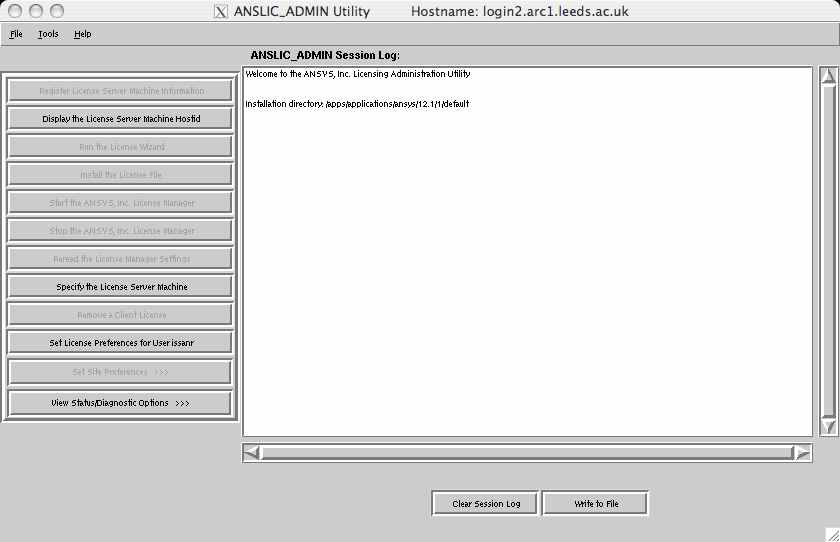
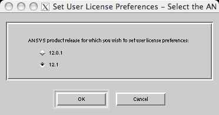
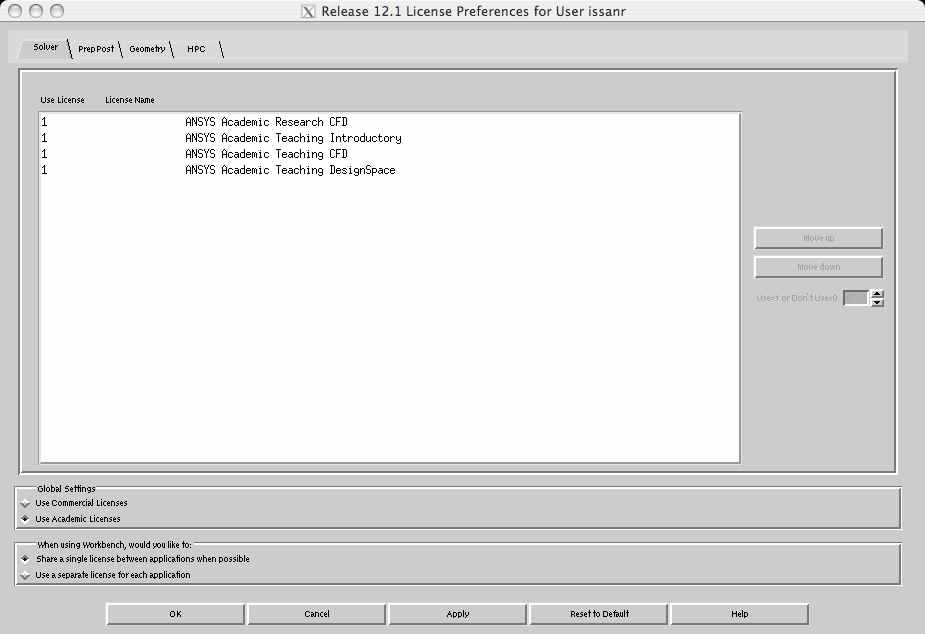

# Ansys

Ansys Mechanical finite element analysis software is used to simulate computer models of structures, electronics, or machine components for analyzing strength, toughness, elasticity, temperature distribution, electromagnetism, fluid flow, and other attributes.

It includes software such as Fluent and CFX.

Versions available: 17.2/18.1/19.1/19.2

URL: [ansys.com](https://ansys.com)

## Licensing

Ansys is licensed software, available to users with a departmental license.

## Usage

### Setup

````{toggle}
  The license is obtained by setting the ANSYSLMD_LICENSE_FILE variable. To set it in bash do:
  ```bash
  $ export ANSYSLMD_LICENSE_FILE=<port>@<host>
  ``` 
  If accessing for the first time, there is an additional step (see the next section on this page) required to choose whether you are using commercial or academic licenses. To get the values of `<port>@<host>` specific to your group/department please contact the Client IT Team via Service Now.

  Before running the Ansys module for the first time, there is a per-user setting that chooses whether commercial (default) or academic licenses should be used.

  For research purposes you should normally be using the academic licenses, unless you are untertaking commercially funded research.

  Check with your supervisor if you need clarification on this.

  You will need a SSH connection with X-forwarding enabled to configure this setting.  Refer to the [getting started guide](../../getting_started/logon).

  If you have not already done so, set the license server and port:
  ```bash
  $ export ANSYSLMD_LICENSE_FILE=<port>@<host>
  ```
  Next, ensure that you have the Ansys module loaded for the particular version you wish to configure its licenses, e.g.:

  ```bash
  $ module add ansys/19.2
  ```
  for Ansys version 19.2

  You now need to launch the license administration interface. The simplest way to do this is to start cfx:

  ```bash
  $ cfx5
  ```
  and select Tools/Ansys client Licensing Utility from the menu.

  This will present you with the following window:

  
  Select “set license preferences for user abcxyz”

  In the next window, select the product you wish to configure (e.g. 12.1)

  
  In the next window that appears, select the radio button that says Use academic licenses:

  
  Select OK, then exit the license manager.

  This will configure Ansys (both Fluent and CFX) to use Academic licenses for all future use.
````

### Interactive usage

In general, interactive use of Ansys tools is discouraged, due to the poor performance.  If it is necessary, please run it via x2go.

### Batch usage

#### Fluent

````{toggle}


##### Running Fluent in Serial mode

  There are three ways in which to launch fluent in serial:

  On the front end, running through an interactive shell, or via the batch queues. Note, when launching the Fluent GUI you must have an X-server running locally and have enabled X11 forwarding through your SSH client.

  Launching on the front end
Once the fluent module is loaded, fluent can be run by entering its name at the command prompt. Please note that this method should not be used apart from for quick tests, i.e.:

  ```
  $ fluent
  ```
  Running interactively through the batch queues
  To launch fluent in serial launch in an interactive shell, issue the following on the command line:
  ```bash
  $ qrsh -cwd -V -l h_rt=<hh:mm:ss> -l h_vmem=<vmem> fluent <dim> -sgeup
  ```

  In the above command, hh:mm:ss is the length of real-time the shell will exist for, vmem is the amount of memory required, dim is the dimension/precision of the fluent process (e.g. 2d for two dimension, single precision).

  For example, to launch the fluent GUI on a back end node to for 3D double precision, issue:
  ```bash
  $ qrsh -cwd -V -l h_rt=6:00:00 -l h_vmem=2G fluent 3ddp -sgeup
  ```
  Running through the batch queues
  When running through the batch queues, no interactive input is possible. It is possible to create a journal file which contains all of the commands that would normally be entered within fluent, e.g. file test.jou :

  ```
  file/read-case test.cas
  file/read-data test.dat
  solve iter 4
  /file/write-data test2.dat
  y
  /exit
  y
  ```
  It is then necessary to construct a script that will run fluent. The script begins with a request for resources and then the executable is run, e.g. file fluent.sh :

  ```bash
  #!/bin/bash
  # Export all variables and use current working directory
  #$ -V -cwd
  # Request three hours of runtime
  #$ -l h_rt=3:00:00
  #Launch the executable
  fluent 3ddp -g -i test.jou
  ```

  In this case, the 3-dimensional, double precision module is launched, however this can be interchanged with any other modules. The -g option will suppress the GUI and -i specifies the name of the input journal file. The file can be submitted to Sun Grid Engine by typing:

  ```bash
  $ qsub fluent.sh
  ```
  The above script assumes that the ansys module is loaded and license is defined. If desired, the module command can be loaded into the batch script (removing the -V ):

  ```bash
  #!/bin/bash
  # Use current working directory
  #$ -cwd
  # Request three hours of runtime
  #$ -l h_rt=3:00:00
  #Launch the executable
  module add ansys/12.1
  export ANSYSLMD_LICENSE_FILE=<LICENSESTRING>
  fluent 3ddp -g -i test.jou -sgeup
  ```
  Running in parallel
  There are three ways of launching Fluent to work in parallel: interactively through an SGE shell, or through batch the batch queues.

  Running via an interactive shell
  To launch an interactive shell on many compute nodes type the following at the command prompt:
  ```bash
  $ qrsh -cwd -V -l h_rt=<hh:mm:ss> -l h_vmem=<vmem> -pe ib <np> fluent <dim> -pib -sgeup
  ```
  In the above commands hh:mm:ss is the length of real-time the shell will exist for and np is the number of processes requested. dim is the dimension/precision of the fluent process (e.g. 3ddp for 3-D double precision).

  E.g. the to launch fluent for 6 hours on 16 processors:
  ```bash
  $ qrsh -cwd -V -l h_rt=6:00:00 -pe ib 16 fluent 2d -pib -sgeup
  ```
  Running a large mesh interactively
  Occasionally, you will need to have interactive access to a large model that requires large amounts of memory and/or cores.
  Whilst it might be possible to use a login node to do this for a short period of time, this is not a preferred option as the login nodes are a shared resource.

  However, you can request an interactive session on the backend compute nodes to do this.

  Remember that each compute node has 16 compute cores and 32GB memory. If you know that your model will require more memory than this, you will need to request multiple cores.

  Running through the batch queues
  Parallel execution via the batch queues is performed by combination of the techniques mentioned above. Firstly a journal file should be created to control the parallel run, without the aid of the GUI; file test_para.jou :

  ```
  file/read-case test_para.cas
  file/read-data test_para.dat
  solve iter 4
  /file/write-data test2_para.dat
  y
  /exit
  y
  ```

  Then a job submission script should be created, that requests resources and executes the code; e.g. file fluent_para.sh
  ```bash
  #!/bin/bash
  # use current working directory
  #$ -cwd
  # Request three hours of runtime
  #$ -l h_rt=3:00:00
  # Run on 32 processors
  #$ -pe ib 32
  #$ define license and load module
  module add ansys/12.1
  export ANSYSLMD_LICENSE_FILE=<LICENSESTRING>
  #Launch the executable
  fluent -g -i test_para.jou 3ddp -pib -sgeup
  ```
  In this case, the 3-dimensional, double precision module is launched on 32 processors. The -g option will suppress the GUI and -i specifies the name of the input journal file. The file can be submitted to Sun Grid Engine by typing:
  ```bash
  $ qsub fluent_para.sh
  ```
  The job will be run once the requested resources become available.

  Running Fluent v16 and above
  When running Fluent v16 or above in parallel batch mode, additional parameters need to be added to the Fluent command line in the batch submission script.

  Taking the script in the previous section as an example, the line:

  ```bash
  fluent -g -i test_para.jou 3ddp -pib -sgeup
  ```
needs to be changed to:
  ```
  fluent -g -i test_para.jou 3ddp -pib -sge -rsh=ssh
  ```

There are also known inefficiencies when running fluent on part nodes on ARC.  For optimal performance, run fluent on whole nodes.  For example, to run on a single node:

  ```bash
  #!/bin/bash
  # use current working directory
  #$ -cwd
  # Request three hours of runtime
  #$ -l h_rt=3:00:00
  # Run on 1 nodes (24 cores on ARC3, 40 cores on ARC4)
  #$ -l nodes=1
  #$ define license and load module
  module add ansys/19.2
  export ANSYSLMD_LICENSE_FILE=<LICENSESTRING>
  #Launch the executable
  fluent -g -i test_para.jou 3ddp -pib -sge -rsh=ssh
  ```

  You will wait slightly longer for a whole node than for the previous allocation method, but your code will run significantly faster.

````

#### CFX
```{toggle}
CFX
CFX
CFX
```

#### Serial
#### Multithreaded
#### MPI 

### Documentation
